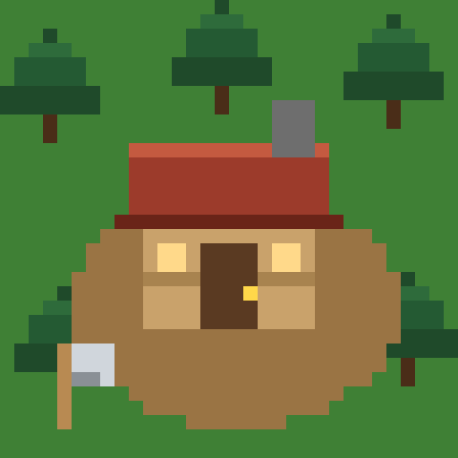

# 🪓 Лесоруб

Уютная пиксельная idle-игра про дровосеков в огромном лесу.

Посреди леса стоит маленький домик. Дровосеки рубят деревья, носят дрова домой и зарабатывают монеты,
а седой старик с книгой нанимает новых работников. Стройте этажи, открывайте новые участки леса,
копайте шахту, сражайтесь с живыми деревьями — и не забывайте про кота.

## Играть

Игра работает прямо в браузере — на компьютере и на телефоне. Её можно **установить как приложение**:
со своей иконкой, в отдельном окне и без интернета. Прогресс сохраняется автоматически.

## Как установить игру

| Устройство | Что сделать |
|---|---|
| Android (Chrome) | Меню ⋮ → «Установить приложение» / «Добавить на главный экран» |
| iPhone / iPad (Safari) | «Поделиться» → «На экран „Домой“» |
| Компьютер (Chrome / Edge) | Значок установки справа в адресной строке → «Установить» |

## Управление

- Клик по дереву — рубить
- Зажать и тянуть дровосека, зверя или кота — поднять и перенести
- Колёсико мыши / щипок двумя пальцами — приближение
- Перетаскивание земли — двигать карту
- Клик по дому — зайти внутрь
- 🕐 часы — зафиксировать время суток

## Файлы

| Файл | Зачем |
|---|---|
| `index.html` | Сама игра (графика, звук и логика в одном файле) |
| `manifest.json` | Название, иконки и цвета для установки как приложения |
| `sw.js` | Работа без интернета |
| `*.png` | Иконки приложения |
| `FONT-LICENSE.txt` | Лицензия шрифта Press Start 2P (SIL Open Font License 1.1) |

## Обновление игры

Замените `index.html`, а в `sw.js` поменяйте `lesorub-v1` на `lesorub-v2` (и так далее при каждом обновлении).
Прогресс игроков сохраняется.

Шрифт **Press Start 2P** © The Press Start 2P Project Authors, лицензия SIL OFL 1.1.
